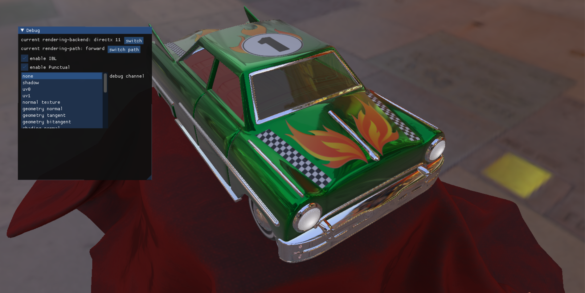
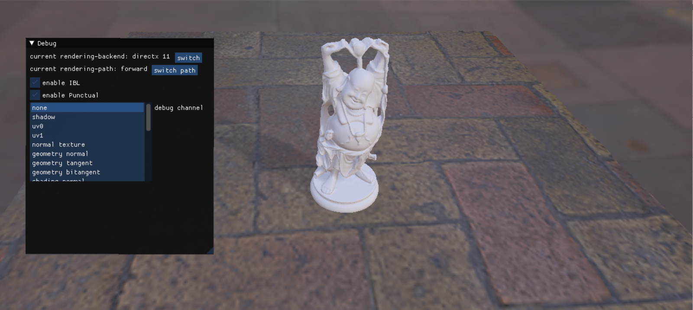
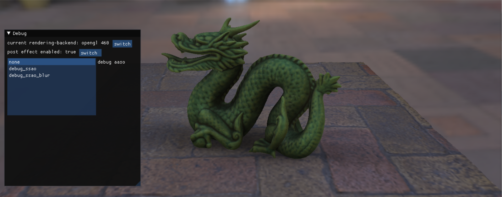
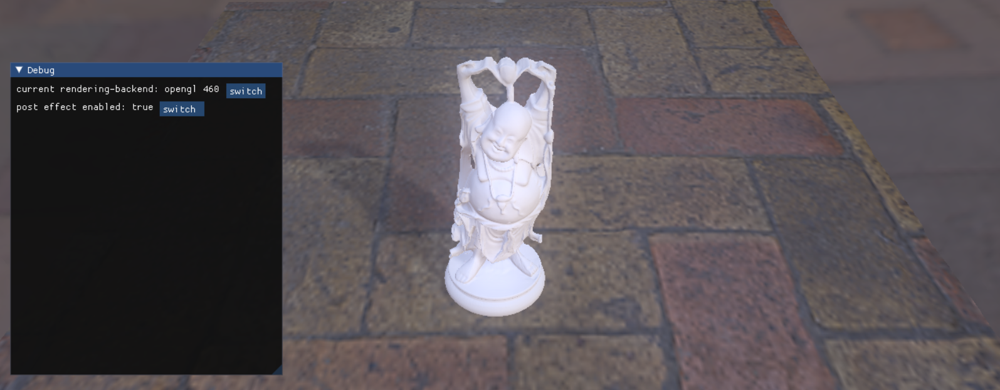

Rendering Engine Support Both Opengl460 And Directx11 Backend
==============================

Features
------
- OpenGL4.6 && Directx11 rendering backend
- GlTF, Fbx, Obj model files
- Skeleton animation
- Coroutine based multi-threading
- Deferred rendering path
- Variance shadow maps
- Post processing
- Horizon Based Ambient Occlusion
- Bloom
- Image based lighting
- ImGUI
- Material runtime editing
- PBR Material:
- - KHR_lights_punctual
- - KHR_materials_clearcoat
- - KHR_materials_emissive_strength
- - KHR_materials_pbrSpecularGlossiness
- - KHR_materials_sheen
- - KHR_materials_transmission

Screenshots
------

ShadowMap

HBAO

Bloom

ImGUI

